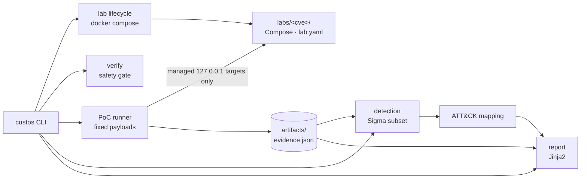

# Custos Vulnerum

**Run the whole vulnerability lifecycle on your own machine: launch a vulnerable lab, prove it, detect the exploit with Sigma, map it to MITRE ATT&CK, mitigate, retest — and export the evidence.**

[](https://github.com/alexiss31/custos-vulnerum/actions/workflows/ci.yml)


[](LICENSE)

Everything runs against Docker labs bound to `127.0.0.1` on isolated per-lab Docker
networks. PoCs are fixed payloads that refuse to touch anything Custos Vulnerum did not
launch — no scanning, no arbitrary targets. Read [SECURITY.md](SECURITY.md) first.

## Quickstart

Prerequisites: Docker (with Compose v2) and [uv](https://docs.astral.sh/uv/).

```bash
git clone https://github.com/alexiss31/custos-vulnerum && cd custos-vulnerum
uv sync --extra dev

uv run custos lab up cve-2021-41773        # launch the vulnerable lab (loopback only)
uv run custos verify cve-2021-41773        # version marker + safety re-check
uv run custos run cve-2021-41773           # controlled PoC → evidence.json
uv run custos detect cve-2021-41773        # Sigma rules → detections + ATT&CK
uv run custos lab up cve-2021-41773 --mitigated   # patched variant (httpd 2.4.51)
uv run custos run cve-2021-41773 --retest  # same PoC must now fail
uv run custos report cve-2021-41773        # report.md + report.html
```

Repeat with `cve-2021-44228` (Log4Shell), or run everything: `make demo`.
Clean up with `uv run custos lab down <id>`.

## Architecture



## Supported labs

| Lab | CVE | Component | Severity | Controlled PoC | Detection | Retest |
|---|---|---|---|---|---|---|
| `cve-2021-41773` | CVE-2021-41773 | Apache HTTP Server 2.4.49 | high (7.5) | traversal → `/etc/passwd` disclosure + CGI `echo;id` | Sigma: traversal in `http_path` | httpd 2.4.51 blocks both |
| `cve-2021-44228` | CVE-2021-44228 | Log4j 2.14.1 (minimal vulnerable webapp) | critical (10.0) | `${jndi:ldap://…}` lookup captured by in-network LDAP canary | Sigma: payload in request/logs + canary LDAP hit | JndiLookup removed → canary silent |

Add your own CVE without touching orchestration: copy `labs/_template/` and follow
[`labs/README.md`](labs/README.md).

## Detection & report

`custos run` writes normalized evidence (timestamp, request, selected logs, result) to
`artifacts/<lab>/<run>/evidence.json`; `custos detect` matches the Sigma v2 rules in
[`detection/sigma/`](detection/sigma/) and attaches MITRE ATT&CK technique IDs;
`custos report` renders the full lifecycle into `report.md` + `report.html`.

Captured from the real end-to-end run (CVE-2021-41773):

```text
$ uv run custos run cve-2021-41773
                     poc cve-2021-41773 (vulnerable) → vulnerable
┌───────────────────────────┬───────┬──────────────────────────────┬──────────┬────────────┐
│ Step                      │ Role  │ Expected                     │ Result   │ Indicators │
├───────────────────────────┼───────┼──────────────────────────────┼──────────┼────────────┤
│ baseline                  │ act   │ status in [200] and body     │ HTTP 200 │ MET        │
│                           │       │ contains ['It works!']       │          │            │
│ traversal-file-disclosure │ proof │ status in [200] and body     │ HTTP 200 │ MET        │
│                           │       │ contains ['root:x:0:0']      │          │            │
│ traversal-cgi-rce         │ proof │ status in [200] and body     │ HTTP 200 │ MET        │
│                           │       │ matches ['uid=[0-9]+...']    │          │            │
└───────────────────────────┴───────┴──────────────────────────────┴──────────┴────────────┘

$ uv run custos detect cve-2021-41773
ATT&CK: T1059.004 (Execution), T1190 (Initial Access)
```

And the report verdict (`artifacts/<lab>/<run>/report.md`):

```markdown
| Stage                  | Environment | Result          | Evidence         |
|------------------------|-------------|-----------------|------------------|
| Verify (vulnerable)    | vulnerable  | True            | 3 checks         |
| PoC                    | vulnerable  | **vulnerable**  | `20260923T055500Z` |
| Detect                 | vulnerable  | 5 rule(s) matched | `20260923T055500Z` |
| Verify (mitigated)     | mitigated   | not run         | —                |
| Retest                 | mitigated   | **not_vulnerable** | `20260923T050842Z` |

**Mitigation effective: verified** (PoC vulnerable → retest not_vulnerable).
```

The Wazuh adapter in [`detection/wazuh/`](detection/wazuh/) is optional — the demo
never requires Wazuh.

## Safety model

- Vulnerable services publish ports on `127.0.0.1` only, on isolated Docker networks
  (`internal: true` where possible) — verified at runtime by `custos verify`.
- PoC steps run only against containers labelled `io.custos.*` and launched by this
  tool; anything else aborts with `SafetyError` before a single packet is sent.
- Payloads are constants of each lab (e.g. the fixed `echo;id`), never user input.
  The Log4Shell callback is an in-network canary: the exploit is proven by the JNDI
  lookup, code delivery is deliberately out of scope.

## Testing & CI

| Command | What it proves |
|---|---|
| `make unit` | unit suite (no Docker needed) |
| `make smoke` | Docker end-to-end lifecycle per lab (skips without Docker) |
| `make sigma` | Sigma rules parse + convert via current SigmaHQ tooling |
| `make audit` | Bandit + pip-audit |
| `make ci` | everything CI runs except the Docker smoke |

CI (GitHub Actions) runs Ruff, mypy, pytest, Bandit, pip-audit and Sigma validation on
every push, plus a Docker lifecycle smoke on `main`.

## Project layout

```text
src/custos_vulnerum/   CLI, typed models, lifecycle, safety gate, PoC runner,
                       evidence, Sigma-subset detector, ATT&CK mapping, reports
labs/<cve>/            Compose (vulnerable + mitigated), lab.yaml, fixtures, mitigation.md
detection/sigma/       Sigma v2 rules (validated with SigmaHQ tooling)
detection/wazuh/       optional Wazuh custom-rule adapter
specs/001-vulnerum-core/  constitution, spec, plan, tasks (Spec-Driven Development)
```

Built Spec-Driven with [github/spec-kit](https://github.com/github/spec-kit) as the
methodology backbone — the constitution, spec, plan and tasks live in
[`.specify/`](.specify/memory/constitution.md) and [`specs/`](specs/001-vulnerum-core/spec.md).

## Acknowledgements

- [vulhub/vulhub](https://github.com/vulhub/vulhub) (MIT) — reference lab setups for
  both CVEs; adaptations keep attribution in file headers. Upstream images used:
  Apache httpd and Apache Log4j (Apache-2.0); the Log4Shell app builds on
  Eclipse Temurin (GPLv2+Classpath Exception).
- [SigmaHQ](https://github.com/SigmaHQ) — Sigma specification v2.1, pySigma and
  sigma-cli (rules are original; style follows the SigmaHQ conventions).
- [MITRE ATT&CK](https://attack.mitre.org/) — technique content (T1190, T1059.004),
  transcribed with source versions in `src/custos_vulnerum/data/attack_techniques.json`.
- [Wazuh](https://wazuh.com/) — ruleset XML syntax for the optional adapter.
- [github/spec-kit](https://github.com/github/spec-kit) (MIT) — Spec-Driven
  Development process and templates.

## License

MIT for original code ([LICENSE](LICENSE)). Third-party material referenced or adapted
keeps its own license and copyright.
